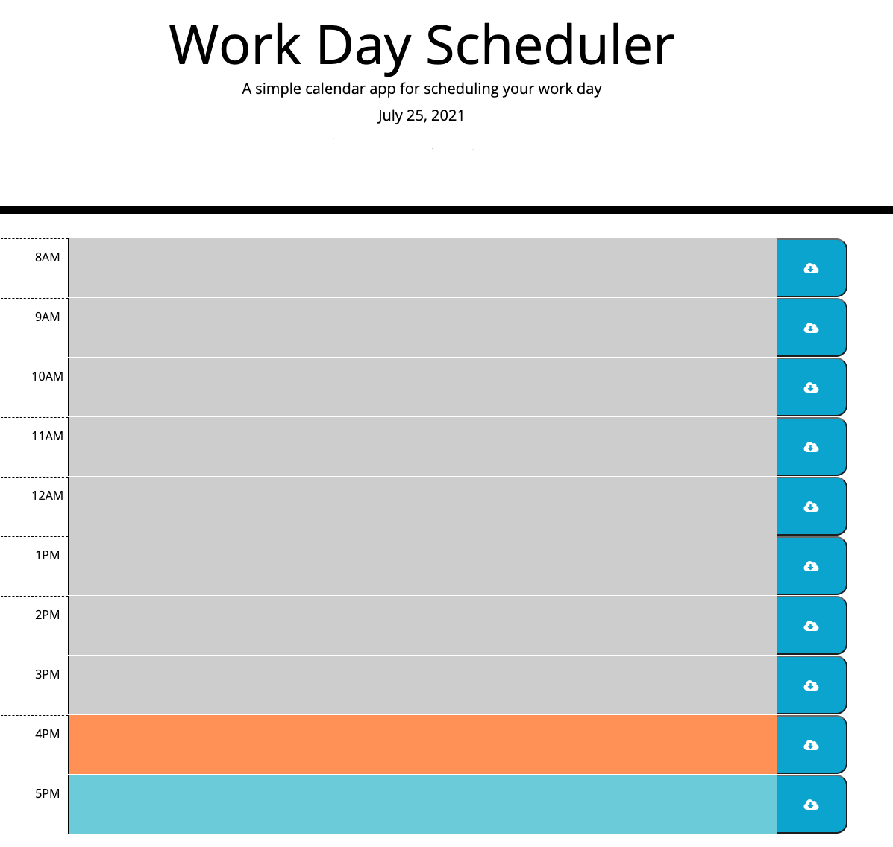
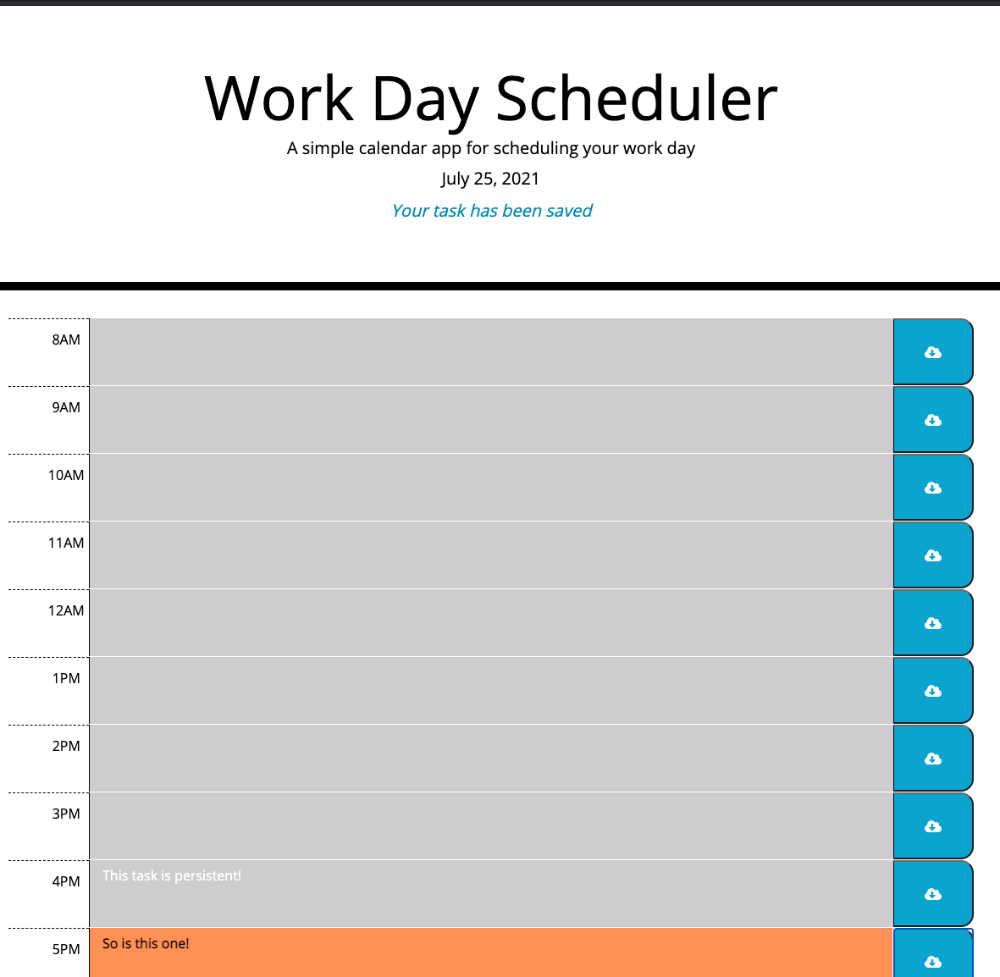

# Workday Scheduler

## DESCRIPTION
Using JavaScript, and third party APIs, this scheduler lets you add a task to a block of time and save it to remain in the schedule when the page re-opens. Based on the time of day, your tasks will be highlighted to reflect if the time has passed, if it is the current time, or if the tasks will be in the future. I utilized the following techniques in creating this project:

* Pseudocoding logic to see what needs to happen in each file
* Usage of third party APIs including:
    * Bootstrap for the grid layout and basic styling
    * jQuery to grab DOM elements by class and id and apply methods and functions
    * Moment.js to grab current date for the header and display colors based on time

This page is viewable at https://bgswilde.github.io/workday-scheduler

See screenshots below:

## CREDITS
This project was done as a part of the Full Stack Web Developer Bootcamp through KU.The basic HTML and CSS were created by Trilogy Education.
© 2021 Trilogy Education Services, LLC, a 2U, Inc. brand. Confidential and Proprietary. All Rights Reserved. 

## LICENSE
MIT License

Copyright (c) 2021 Brian Wilde

Permission is hereby granted, free of charge, to any person obtaining a copy
of this software and associated documentation files (the "Software"), to deal
in the Software without restriction, including without limitation the rights
to use, copy, modify, merge, publish, distribute, sublicense, and/or sell
copies of the Software, and to permit persons to whom the Software is
furnished to do so, subject to the following conditions:

The above copyright notice and this permission notice shall be included in all
copies or substantial portions of the Software.

THE SOFTWARE IS PROVIDED "AS IS", WITHOUT WARRANTY OF ANY KIND, EXPRESS OR
IMPLIED, INCLUDING BUT NOT LIMITED TO THE WARRANTIES OF MERCHANTABILITY,
FITNESS FOR A PARTICULAR PURPOSE AND NONINFRINGEMENT. IN NO EVENT SHALL THE
AUTHORS OR COPYRIGHT HOLDERS BE LIABLE FOR ANY CLAIM, DAMAGES OR OTHER
LIABILITY, WHETHER IN AN ACTION OF CONTRACT, TORT OR OTHERWISE, ARISING FROM,
OUT OF OR IN CONNECTION WITH THE SOFTWARE OR THE USE OR OTHER DEALINGS IN THE
SOFTWARE.